# 虹越花卉RDS-MySQL5.5升级RDS-MySQL5.6实施详细

| 实施时间       | 实施人  |
| ---------- | ---- |
| 2017-07-20 | 魏亚萍  |
| 2017-08-03 | 魏亚萍  |

[TOC]

# 1 需求

客户目前使用的是RDS-MySQL5.5版本，想先开个按量付费的RDS-MySQL5.6版本，然后5.5现有的数据迁移到新的RDS，测试应用业务，没问题就释放新的RDS，升级原有的5.5。

为保障整个迁移过程顺利进行，并最大减少对业务的影响，特制定本实施方案。

# 2 实施方案

| 阶段   | 阶段名称                | 操作人员 | 预计耗时       | 实际耗时 | 注意事项         |
| ---- | ------------------- | ---- | ---------- | ---- | ------------ |
| 1    | 购买迁移服务DTS           | 魏    | 15分钟       | 22分钟 |              |
| 2    | 迁移RDS 5.5 至 RDS 5.6 | 魏    | 根据迁移的数据量大小 | 34分钟 | 进行全量迁移       |
| 3    | 测试迁移后的RDS 5.6版本的兼容性 | 冯/魏  | 0.5工作日     | 8工作日 | 从数据库及应用的角度测试 |
| 4    | RDS 5.5升级到RDS 5.6   | 魏    | 30分钟       | 49分钟 |              |
| 5    | 测试升级后的5.6版本         | 冯/陈  | 0.5工作日     |      | 从数据库及应用的角度测试 |
| 6    | 项目后续跟踪              | 魏    | 10分钟       |      |              |

 

# 2.1准备工作

| 账号    | 登陆方式 | Username | Password  |                      |         |         |             |
| ----- | ---- | -------- | --------- | -------------------- | ------- | ------- | ----------- |
| 登陆    |      |          |           |                      |         |         |             |
| RSD实例 | 云类型  | 网络类型     | 数据库版本     | 实例ID                 | db_name | db_user | db_password |
| 目标实例  | 公共云  | 经典网络     | MySQL 5.6 | rm-bp11woahpf4hqt54t |         | zyadmin |             |
| 源实例测试 | 公共云  | 经典网络     | MySQL 5.5 | rdsiiavyfvbqnnb      | All     | zyadmin |             |

# 3 具体步骤

## 3.1 购买RDS 5.6实例测试兼容性

### 3.1.1开通按量付费的RDS 5.6

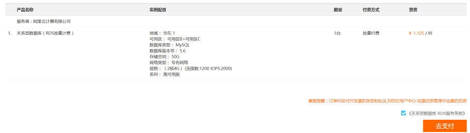

### 3.1.2 DTS进行RDS迁移

1.新购目标RDS添加账号zyadmin

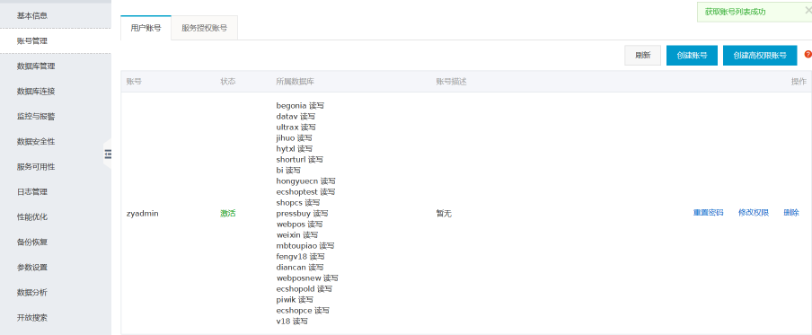

2.源RDS添加只读账号zyadmin

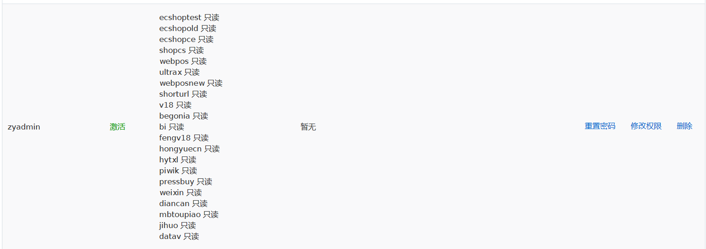

3.创建迁移任务

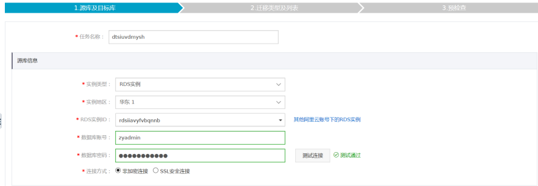

4.确认购买DTS迁移服务

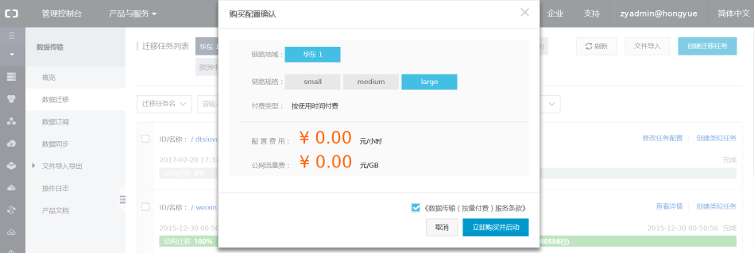

5.查看迁移任务

6.等待任务完成

7.迁移过程中的源库性能

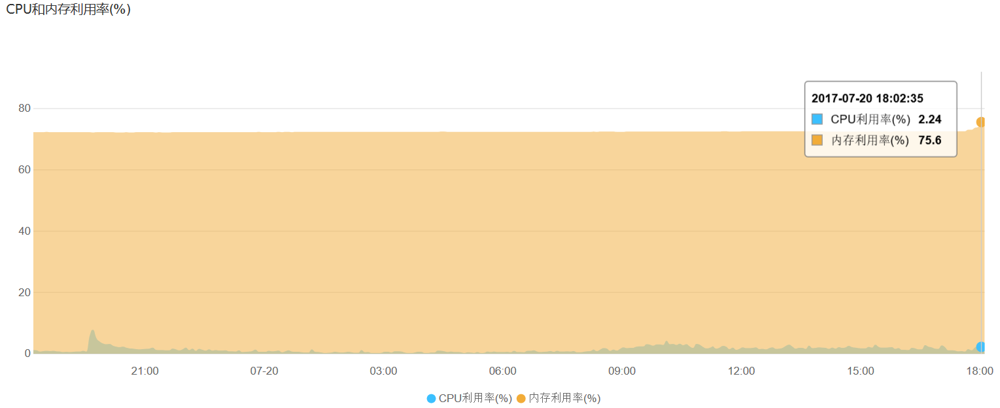
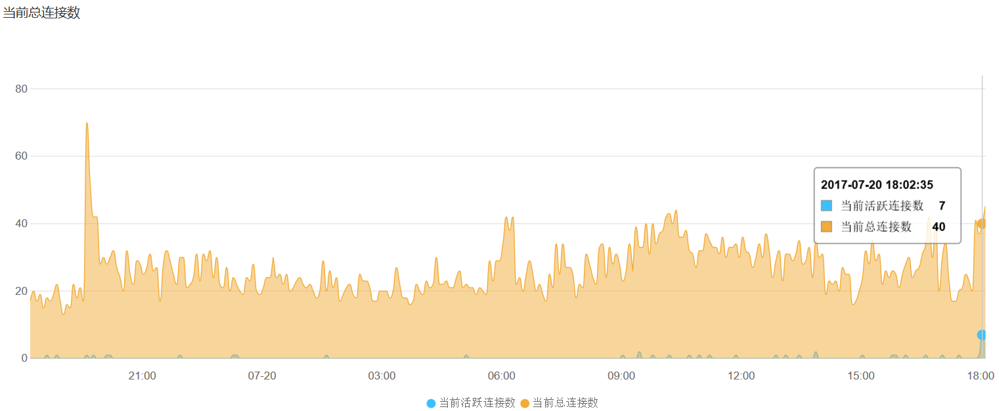
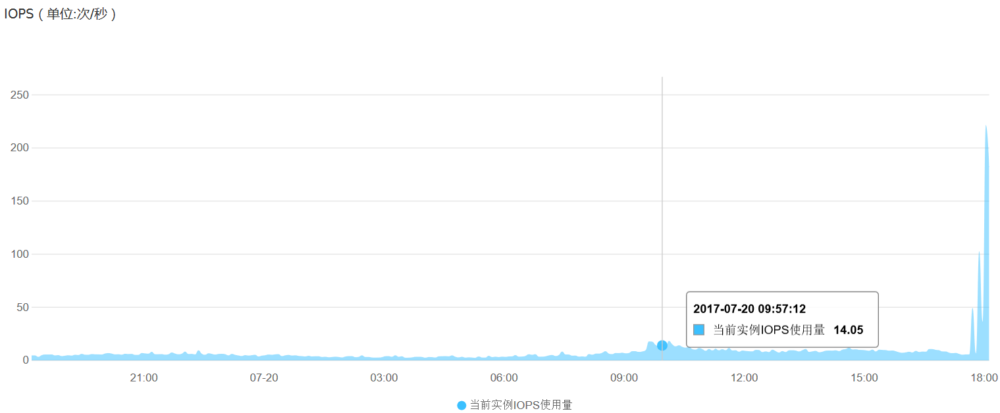
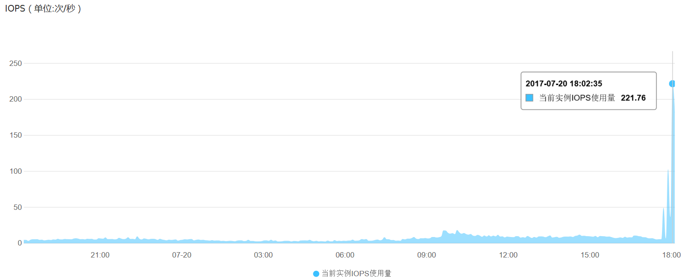
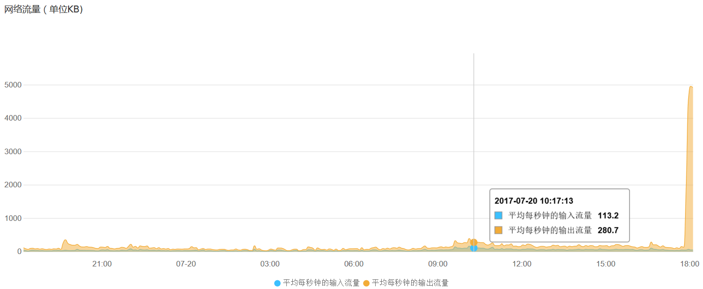
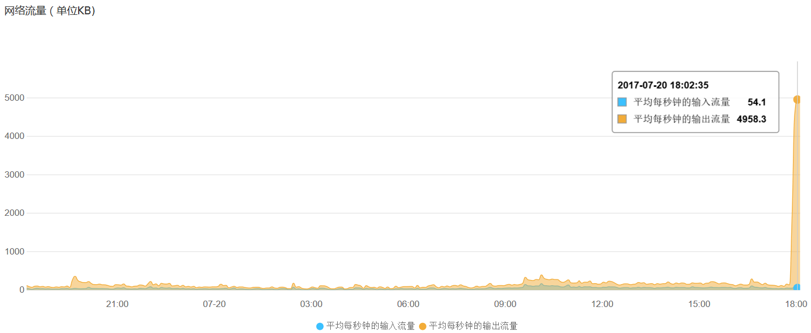

可以看到cpu的压力不是很大，但是对磁盘和网络压力比较大，IOPS压力从14到220，增长比例在1400%（220-14/14=14）

8.迁移速度

| 源库规格  | 公有云 VPC 华东1  8核\16G\50G\4000IOPS |
| ----- | -------------------------------- |
| 目标库规格 | 公有云 VPC 华东1  2核\4G\50G\1200IOPS  |
| 数据量   | 17.13G                           |
| DTS规格 | Large                            |
| 迁移时间  | 34分钟                             |
| 迁移速度  | 30G/h                            |

### 3.1.3 测试兼容性

在测试没有问题后，再开始做升级

## 3.2 RDS5.5升级到5.6

升级前的系统监控情况如下：

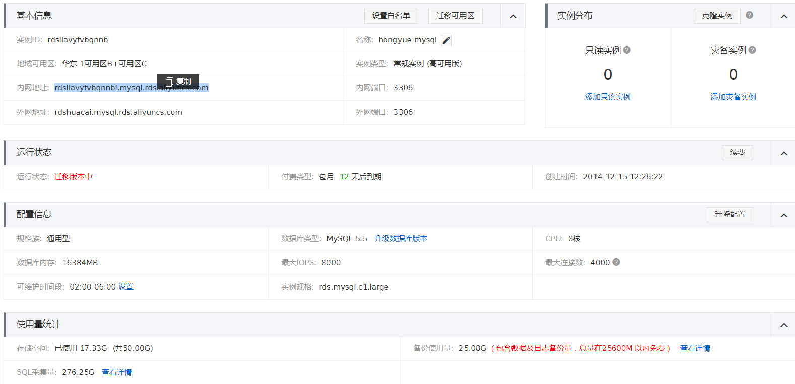

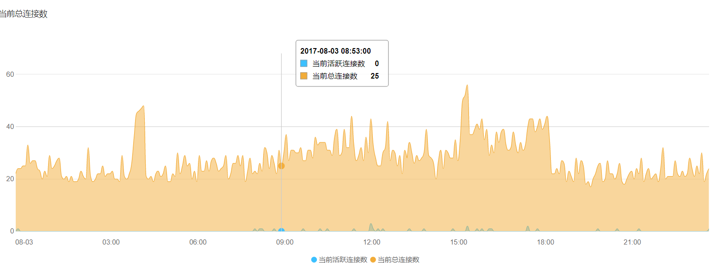
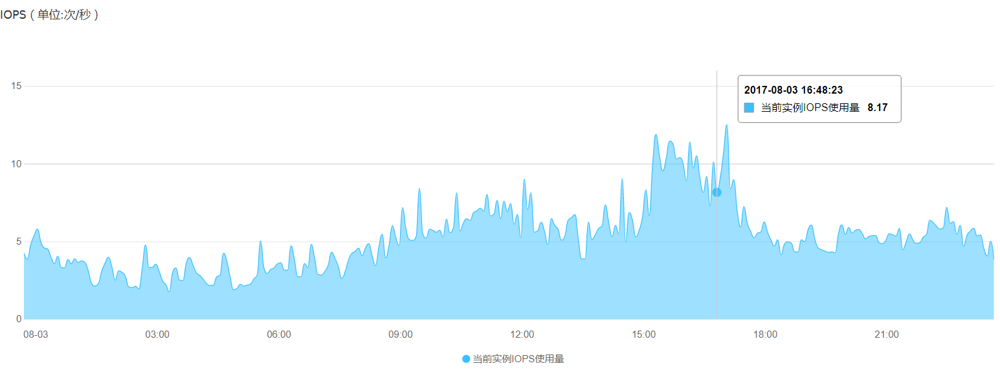
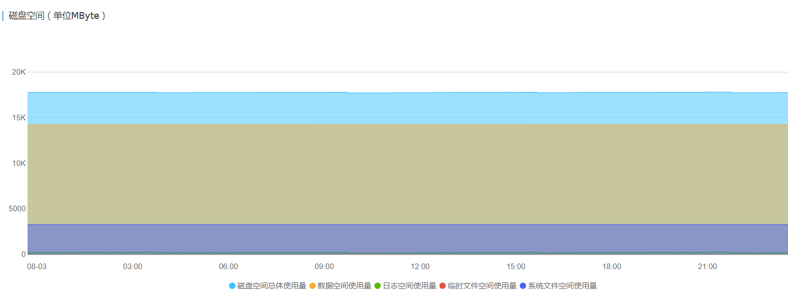
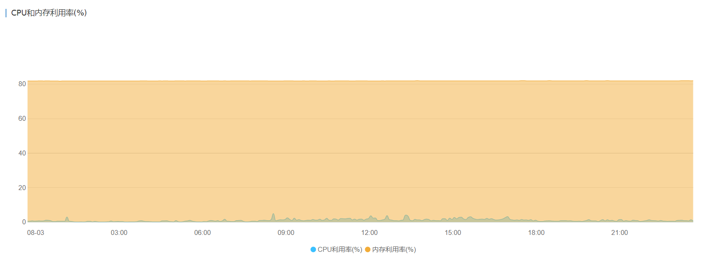

### 3.2.1 进入控制台，点击升级数据库版本

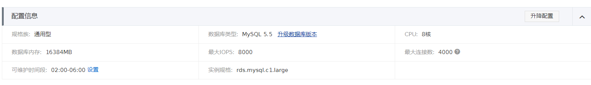

### 3.2.2 点击RDS 5.5升级

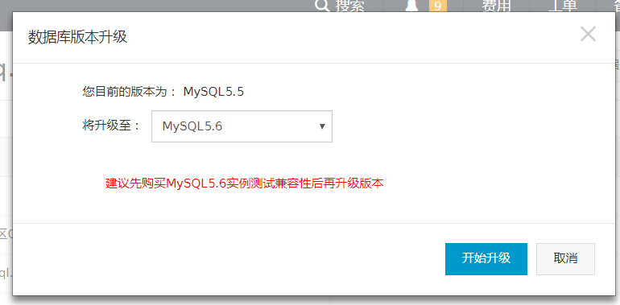
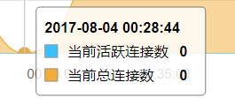

升级于00:30:00左右完成

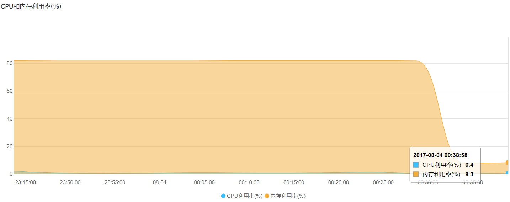

升级后的内存利用率降低了

升级8小时候的数据库资源使用情况

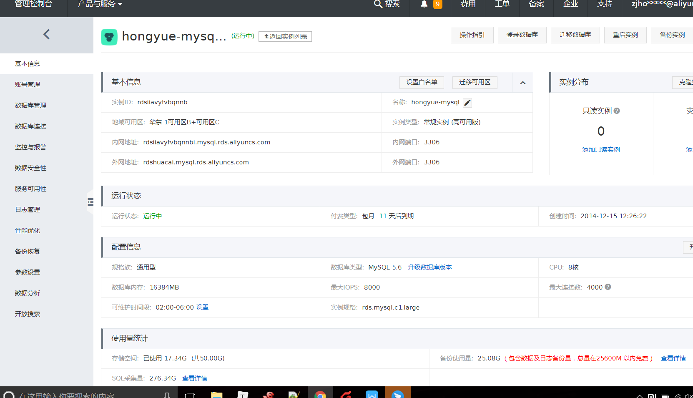
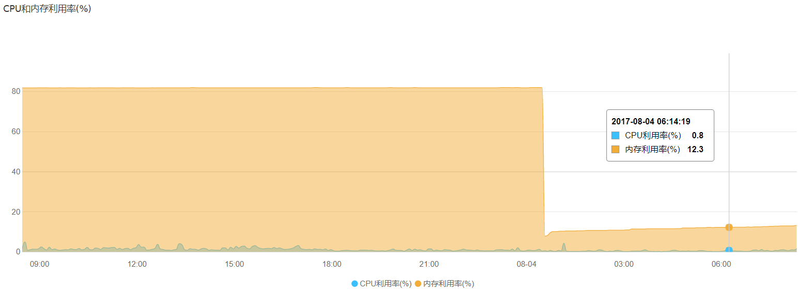
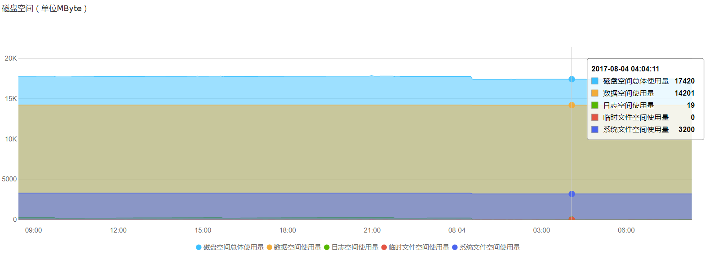
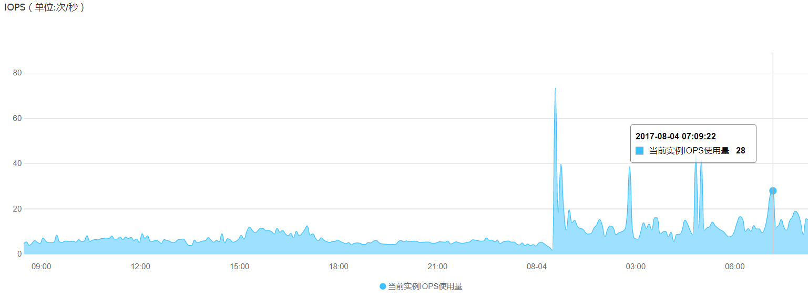
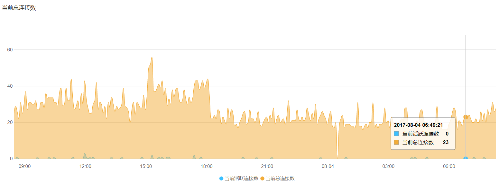
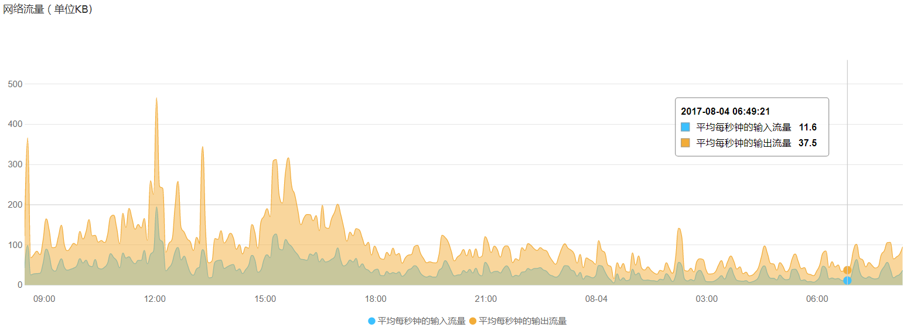

### 3.2.3 测试升级后的5.6版本

从数据库及应用的角度测试

## 4 总结

## 4.1 DTS迁移

| 源库规格       | 公有云 VPC 华东1  8核\16G\50G\4000IOPS mysql5.5 |
| ---------- | ---------------------------------------- |
| 目标库规格      | 公有云 VPC 华东1  2核\4G\50G\1200IOPS mysql5.6 |
| 数据量        | 17.13G                                   |
| DTS规格      | Large                                    |
| 迁移时间       | 34分钟                                     |
| 迁移速度       | 30G/h                                    |
| 源库IOPS上涨比例 | 1400%（14-220）                            |

## 4.2 RDS升级

#### 

| 源库规格     | 公有云 VPC 华东1  8核\16G\50G\4000IOPS mysql5.5 |
| -------- | ---------------------------------------- |
| 目标库规格    | 公有云 VPC 华东1  8核\16G\50G\4000IOPS mysql5.6 |
| 数据量      | 17.13G                                   |
| 升级时间     | 49分钟                                     |
| 源库资源使用变化 | 升级结束时内存使用率较低（后台重启），iops突发地上涨后恢复正常           |

实例规格升级耗时
 根据本地资源情况分为本地升级和远程升级。本地升级一般会在几分钟左右生效，远程升级会需要更多时间，具体需要的时间因为和多种因素（比如实例数据量、实例增量数据等）相关，因此确实无法预期。升级过程中不会影响当前实例的正常使用，但期间不能在控制台进行管理操作；升级的最后有次持续约30秒的闪断，需要您提前做好准备，并设置好程序跟RDS的自动重连，避免因为升级的闪断导致您的服务不可用。  

本地升级: 比如扩容实例空间,如果扩容的空间在实例所在的物理机足够,就在本地完成升级. 否则就远程升级. 

远程升级: 就是在符合条件的远程主机上为您搭建个新实例,然后将数据迁移过去. 一般情况下,内存,cpu升级都是远程升级.  

帮助文档

[阿里迁移工具DTS的购买帮助](https://help.aliyun.com/document_detail/26604.html?spm=5176.doc26612.6.550.yzWYZh)
[阿里DTS实现RDS实例间的数据迁移帮助文档](https://help.aliyun.com/document_detail/26626.html?spm=5176.doc26211.2.1.wtmN61)
[阿里rds升级帮助文档](https://help.aliyun.com/knowledge_detail/41865.html)
[阿里rds升级注意事项](https://help.aliyun.com/knowledge_detail/41872.html)

