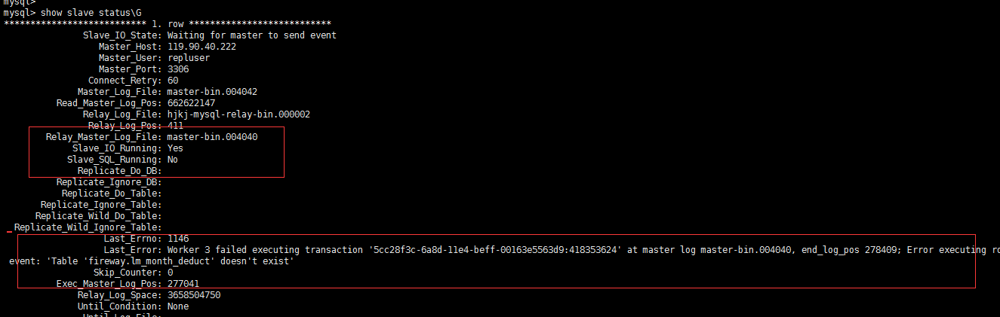

# 客户mysql ab replication 搭建报错

[TOC]


## 报错信息

客户用的gtid同步方式，当前同步报错



## 排错信息获取

### 客户权限

| 服务器    | ip：ssh_prot           | os用户名 | os密码         | mysql用户名 | mysql密码          | prot |
| ------ | --------------------- | ----- | ------------ | -------- | ---------------- | ---- |
| master | 用户不给                  |       |              |          |                  |      |
| slave  | 139.224.146.153:22222 | root  | qq624991557. | root     | cqhjkj624991557. | 3306 |

### 硬件信息

| 服务器   | 品牌             | cpu  | 内存   |
| ----- | -------------- | ---- | ---- |
| slave | 阿里云的金融云 x86_64 | 4核   | 15G  |

### 操作系统信息

| 发行版本                                 | 内核版本                      |
| ------------------------------------ | ------------------------- |
| CentOS Linux release 7.0.1406 (Core) | 3.10.0-123.9.3.el7.x86_64 |

### 架构和软件

| 架构        | 软件版本                                     |
| --------- | ---------------------------------------- |
| MySQL主从同步 | mysql  Ver 14.14 Distrib 5.6.36, for Linux (x86_64) using  EditLine wrapper |


```shell
[root@hjkj-mysql ~]# cat /etc/redhat-release 
CentOS Linux release 7.0.1406 (Core) 
[root@hjkj-mysql ~]# uname -r
3.10.0-123.9.3.el7.x86_64
[root@hjkj-mysql ~]# lscpu
Architecture:          x86_64
CPU op-mode(s):        32-bit, 64-bit
Byte Order:            Little Endian
CPU(s):                4
On-line CPU(s) list:   0-3
Thread(s) per core:    1
Core(s) per socket:    4
Socket(s):             1
NUMA node(s):          1
Vendor ID:             GenuineIntel
CPU family:            6
Model:                 79
Model name:            Intel(R) Xeon(R) CPU E5-2682 v4 @ 2.50GHz
Stepping:              1
CPU MHz:               2500.028
BogoMIPS:              5000.05
Hypervisor vendor:     KVM
Virtualization type:   full
L1d cache:             32K
L1i cache:             32K
L2 cache:              256K
L3 cache:              40960K
NUMA node0 CPU(s):     0-3
[root@hjkj-mysql ~]# free -h

             total       used       free     shared    buffers     cached
Mem:           15G        15G       159M       8.4M       183M        14G
-/+ buffers/cache:       906M        14G
Swap:           0B         0B         0B
[root@hjkj-mysql ~]# mysql -V
mysql  Ver 14.14 Distrib 5.6.36, for Linux (x86_64) using  EditLine wrapper
```

### MySQL配置信息

| 类型                         | 路径                                       |
| -------------------------- | ---------------------------------------- |
| 配置文件                       | /etc/my.cnf                              |
| 数据目录                       | datadir=/HJKJ-DATA/mysql/data            |
| 二进制日志                      | log-bin = /data/mysqlLog/logs/mysql-bin  |
| 错误日志                       | log-err=/data/mysqlLog/logs/error.log    |
| socket文件                   | socket=/var/lib/mysql/mysql.sock         |
| 慢查询日志                      | slow_query_log_file = /data/mysqlLog/logs/mysql.slow |
| Gtid模式                     | 开启                                       |
| master-info;relay-log-info | 保存方式为表                                   |


 


```shell
[root@hjkj-mysql ~]# cat /etc/my.cnf
# For advice on how to change settings please see
# http://dev.mysql.com/doc/refman/5.6/en/server-configuration-defaults.html

[mysqld]
#
# Remove leading # and set to the amount of RAM for the most important data
# cache in MySQL. Start at 70% of total RAM for dedicated server, else 10%.
# innodb_buffer_pool_size = 128M
#
# Remove leading # to turn on a very important data integrity option: logging
# changes to the binary log between backups.
# log_bin
#
# Remove leading # to set options mainly useful for reporting servers.
# The server defaults are faster for transactions and fast SELECTs.
# Adjust sizes as needed, experiment to find the optimal values.
# join_buffer_size = 128M
# sort_buffer_size = 2M
# read_rnd_buffer_size = 2M

#datadir=/var/lib/mysql
datadir=/HJKJ-DATA/mysql/data
socket=/var/lib/mysql/mysql.sock
#socket=/HJKJ-DATA/mysql/data/mysql.sock
# Disabling symbolic-links is recommended to prevent assorted security risks
symbolic-links=0

# Recommended in standard MySQL setup
sql_mode=NO_ENGINE_SUBSTITUTION,STRICT_TRANS_TABLES 

[client]
port = 3306
default-character-set = utf8
[mysql]
no-auto-rehash
default-character-set = utf8
[mysqld]
server-id = 153
port = 3306
user = mysql
basedir = /usr/local/mysql
default-storage-engine = INNODB
connect_timeout = 60
wait_timeout = 18000
back_log = 500
event_scheduler = ON
log-bin = /data/mysqlLog/logs/mysql-bin
binlog_format = row
max_binlog_size = 128M
binlog_cache_size = 2M
expire-logs-days = 5
log-slave-updates=true
gtid-mode=on
enforce-gtid-consistency=true
master-info-repository=TABLE
relay-log-info-repository=TABLE
sync-master-info=1
slave-parallel-workers=4
#rpl_semi_sync_master_enabled = 1
slow_query_log = 1
slow_query_log_file = /data/mysqlLog/logs/mysql.slow
long_query_time = 1
log_error = /data/mysqlLog/logs/error.log
max_connections = 3000
max_connect_errors = 10000
log_bin_trust_function_creators = 1
transaction_isolation = READ-COMMITTED
```


```shell
[root@hjkj-mysql ~]# mysql -uroot -p'cqhjkj624991557.'
Warning: Using a password on the command line interface can be insecure.
Welcome to the MySQL monitor.  Commands end with ; or \g.
Your MySQL connection id is 55
Server version: 5.6.36-log MySQL Community Server (GPL)

Copyright (c) 2000, 2017, Oracle and/or its affiliates. All rights reserved.

Oracle is a registered trademark of Oracle Corporation and/or its
affiliates. Other names may be trademarks of their respective
owners.

Type 'help;' or '\h' for help. Type '\c' to clear the current input statement.

mysql> show slave status\G;
*************************** 1. row ***************************
               Slave_IO_State: Waiting for master to send event
                  Master_Host: 119.90.40.222
                  Master_User: repluser
                  Master_Port: 3306
                Connect_Retry: 60
              Master_Log_File: master-bin.004044
          Read_Master_Log_Pos: 228803725
               Relay_Log_File: hjkj-mysql-relay-bin.000002
                Relay_Log_Pos: 411
        Relay_Master_Log_File: master-bin.004040
             Slave_IO_Running: Yes
            Slave_SQL_Running: No
              Replicate_Do_DB: 
          Replicate_Ignore_DB: 
           Replicate_Do_Table: 
       Replicate_Ignore_Table: 
      Replicate_Wild_Do_Table: 
  Replicate_Wild_Ignore_Table: 
                   Last_Errno: 1062
                   Last_Error: Worker 3 failed executing transaction '5cc28f3c-6a8d-11e4-beff-00163e5563d9:418353625' at master log master-bin.004040, end_log_pos 278982; Could not execute Write_rows event on table fireway.bm_job_task_log; Duplicate entry '21732920' for key 'PRIMARY', Error_code: 1062; handler error HA_ERR_FOUND_DUPP_KEY; the event's master log master-bin.004040, end_log_pos 278982
                 Skip_Counter: 0
          Exec_Master_Log_Pos: 277041
              Relay_Log_Space: 5372268548
              Until_Condition: None
               Until_Log_File: 
                Until_Log_Pos: 0
           Master_SSL_Allowed: No
           Master_SSL_CA_File: 
           Master_SSL_CA_Path: 
              Master_SSL_Cert: 
            Master_SSL_Cipher: 
               Master_SSL_Key: 
        Seconds_Behind_Master: NULL
Master_SSL_Verify_Server_Cert: No
                Last_IO_Errno: 0
                Last_IO_Error: 
               Last_SQL_Errno: 1062
               Last_SQL_Error: Worker 3 failed executing transaction '5cc28f3c-6a8d-11e4-beff-00163e5563d9:418353625' at master log master-bin.004040, end_log_pos 278982; Could not execute Write_rows event on table fireway.bm_job_task_log; Duplicate entry '21732920' for key 'PRIMARY', Error_code: 1062; handler error HA_ERR_FOUND_DUPP_KEY; the event's master log master-bin.004040, end_log_pos 278982
  Replicate_Ignore_Server_Ids: 
             Master_Server_Id: 100
                  Master_UUID: 5cc28f3c-6a8d-11e4-beff-00163e5563d9
             Master_Info_File: mysql.slave_master_info
                    SQL_Delay: 0
          SQL_Remaining_Delay: NULL
      Slave_SQL_Running_State: 
           Master_Retry_Count: 86400
                  Master_Bind: 
      Last_IO_Error_Timestamp: 
     Last_SQL_Error_Timestamp: 170711 09:11:50
               Master_SSL_Crl: 
           Master_SSL_Crlpath: 
           Retrieved_Gtid_Set: 5cc28f3c-6a8d-11e4-beff-00163e5563d9:418353624-418560709
            Executed_Gtid_Set: 5cc28f3c-6a8d-11e4-beff-00163e5563d9:1-418353624,
8480a8c6-62c5-11e7-9c43-00163e00013d:1-16
                Auto_Position: 1
1 row in set (0.00 sec)

ERROR: 
No query specified


[root@hjkj-mysql HJKJ-DATA]# du -h
16K	./lost+found
9.8G	./finance20170707
1.6M	./mysql/FBI
15M	./mysql/etl
51M	./mysql/edw
2.1M	./mysql/mysql
8.0K	./mysql/data/edw
13G	./mysql/data/finance
221G	./mysql/data/fireway
11M	./mysql/data/mysql
636K	./mysql/data/performance_schema
15M	./mysql/data/etl2020
239G	./mysql/data
636K	./mysql/performance_schema
239G	./mysql
159G	./fireway20170707
407G	.


mysql> desc fireway.bm_job_task_log;
+---------------+--------------+------+-----+---------+----------------+
| Field         | Type         | Null | Key | Default | Extra          |
+---------------+--------------+------+-----+---------+----------------+
| SEQ           | bigint(10)   | NO   | PRI | NULL    | auto_increment |
| job_full_name | varchar(50)  | NO   | MUL | NULL    |                |
| biz_date      | datetime     | NO   |     | NULL    |                |
| task_key      | varchar(50)  | NO   | MUL | NULL    |                |
| message       | varchar(750) | YES  |     | NULL    |                |
| log_time      | datetime     | YES  |     | NULL    |                |
+---------------+--------------+------+-----+---------+----------------+
6 rows in set (0.00 sec)


mysql>  show global variables like '%GTID%'; 
+---------------------------------+---------------------------------------------------------------------------------------------+
| Variable_name                   | Value                                                                                       |
+---------------------------------+---------------------------------------------------------------------------------------------+
| binlog_gtid_simple_recovery     | OFF                                                                                         |
| enforce_gtid_consistency        | ON                                                                                          |
| gtid_executed                   | 5cc28f3c-6a8d-11e4-beff-00163e5563d9:1-418353624,
8480a8c6-62c5-11e7-9c43-00163e00013d:1-16 |
| gtid_mode                       | ON                                                                                          |
| gtid_owned                      |                                                                                             |
| gtid_purged                     | 5cc28f3c-6a8d-11e4-beff-00163e5563d9:1-418353618                                            |
| simplified_binlog_gtid_recovery | OFF                                                                                         |
+---------------------------------+---------------------------------------------------------------------------------------------+
7 rows in set (0.00 sec)


[root@hjkj-mysql data]# mysqlbinlog --no-defaults -v -v hjkj-mysql-relay-bin.000002 | sed -n '/at 411/,$p' | grep -C 10 'bm_job_task_log'|grep -C 30 21732920|grep ^###
WARNING: The range of printed events ends with a row event or a table map event that does not have the STMT_END_F flag set. This might be because the last statement was not fully written to the log, or because you are using a --stop-position or --stop-datetime that refers to an event in the middle of a statement. The event(s) from the partial statement have not been written to output.
### INSERT INTO `fireway`.`bm_job_task_log`
### SET
###   @1=21732920 /* LONGINT meta=0 nullable=0 is_null=0 */
###   @2='defaultJobGroup.LoginSMSJob' /* VARSTRING(150) meta=150 nullable=0 is_null=0 */
###   @3='2017-05-27 00:00:00' /* DATETIME(0) meta=0 nullable=0 is_null=0 */
###   @4='LoginSMSTask' /* VARSTRING(150) meta=150 nullable=0 is_null=0 */
###   @5='任务开始执行...' /* VARSTRING(2250) meta=2250 nullable=1 is_null=0 */
###   @6='2017-05-28 01:10:42' /* DATETIME(0) meta=0 nullable=1 is_null=0 */


mysql> select * from bm_job_task_log where SEQ=21732920;
+----------+-----------------------------+---------------------+--------------+-----------------------+---------------------+
| SEQ      | job_full_name               | biz_date            | task_key     | message               | log_time            |
+----------+-----------------------------+---------------------+--------------+-----------------------+---------------------+
| 21732920 | defaultJobGroup.LoginSMSJob | 2017-05-27 00:00:00 | LoginSMSTask | 任务开始执行...       | 2017-05-28 01:10:42 |
+----------+-----------------------------+---------------------+--------------+-----------------------+---------------------+
1 row in set (0.00 sec)


[root@hjkj-mysql data]# mysqlbinlog --no-defaults -v -v hjkj-mysql-relay-bin.000002 | sed -n '/at 411/,$p' | grep -C 10 'bm_job_task_log'|sed -n '/21732920/,$p'|grep ^###
###   @1=21732920 /* LONGINT meta=0 nullable=0 is_null=0 */
###   @2='defaultJobGroup.LoginSMSJob' /* VARSTRING(150) meta=150 nullable=0 is_null=0 */
###   @3='2017-05-27 00:00:00' /* DATETIME(0) meta=0 nullable=0 is_null=0 */
###   @4='LoginSMSTask' /* VARSTRING(150) meta=150 nullable=0 is_null=0 */
###   @5='任务开始执行...' /* VARSTRING(2250) meta=2250 nullable=1 is_null=0 */
###   @6='2017-05-28 01:10:42' /* DATETIME(0) meta=0 nullable=1 is_null=0 */
### INSERT INTO `fireway`.`bm_job_task_log`
### SET
###   @1=21732921 /* LONGINT meta=0 nullable=0 is_null=0 */
###   @2='defaultJobGroup.LoginSMSJob' /* VARSTRING(150) meta=150 nullable=0 is_null=0 */
###   @3='2017-05-27 00:00:00' /* DATETIME(0) meta=0 nullable=0 is_null=0 */
###   @4='LoginSMSTask' /* VARSTRING(150) meta=150 nullable=0 is_null=0 */
###   @5='任务执行结束!' /* VARSTRING(2250) meta=2250 nullable=1 is_null=0 */
###   @6='2017-05-28 01:10:42' /* DATETIME(0) meta=0 nullable=1 is_null=0 */
### INSERT INTO `fireway`.`bm_job_task_log`
### SET
###   @1=21732922 /* LONGINT meta=0 nullable=0 is_null=0 */
###   @2='defaultJobGroup.LoginSMSJob' /* VARSTRING(150) meta=150 nullable=0 is_null=0 */
###   @3='2017-05-27 00:00:00' /* DATETIME(0) meta=0 nullable=0 is_null=0 */
###   @4='LoginSMSTask' /* VARSTRING(150) meta=150 nullable=0 is_null=0 */
###   @5='任务开始执行...' /* VARSTRING(2250) meta=2250 nullable=1 is_null=0 */
###   @6='2017-05-28 01:10:45' /* DATETIME(0) meta=0 nullable=1 is_null=0 */
### INSERT INTO `fireway`.`bm_job_task_log`
### SET
###   @1=21732923 /* LONGINT meta=0 nullable=0 is_null=0 */
###   @2='defaultJobGroup.LoginSMSJob' /* VARSTRING(150) meta=150 nullable=0 is_null=0 */
###   @3='2017-05-27 00:00:00' /* DATETIME(0) meta=0 nullable=0 is_null=0 */
###   @4='LoginSMSTask' /* VARSTRING(150) meta=150 nullable=0 is_null=0 */
###   @5='任务执行结束!' /* VARSTRING(2250) meta=2250 nullable=1 is_null=0 */
###   @6='2017-05-28 01:10:45' /* DATETIME(0) meta=0 nullable=1 is_null=0 */
### INSERT INTO `fireway`.`bm_job_task_log`
### SET
###   @1=21732924 /* LONGINT meta=0 nullable=0 is_null=0 */
###   @2='defaultJobGroup.LoginSMSJob' /* VARSTRING(150) meta=150 nullable=0 is_null=0 */
###   @3='2017-05-27 00:00:00' /* DATETIME(0) meta=0 nullable=0 is_null=0 */
###   @4='LoginSMSTask' /* VARSTRING(150) meta=150 nullable=0 is_null=0 */
###   @5='任务开始执行...' /* VARSTRING(2250) meta=2250 nullable=1 is_null=0 */
###   @6='2017-05-28 01:10:48' /* DATETIME(0) meta=0 nullable=1 is_null=0 */
### INSERT INTO `fireway`.`bm_job_task_log`
### SET
###   @1=21732925 /* LONGINT meta=0 nullable=0 is_null=0 */
###   @2='defaultJobGroup.LoginSMSJob' /* VARSTRING(150) meta=150 nullable=0 is_null=0 */
###   @3='2017-05-27 00:00:00' /* DATETIME(0) meta=0 nullable=0 is_null=0 */
###   @4='LoginSMSTask' /* VARSTRING(150) meta=150 nullable=0 is_null=0 */
###   @5='任务执行结束!' /* VARSTRING(2250) meta=2250 nullable=1 is_null=0 */
###   @6='2017-05-28 01:10:48' /* DATETIME(0) meta=0 nullable=1 is_null=0 */
### INSERT INTO `fireway`.`bm_job_task_log`
### SET
WARNING: The range of printed events ends with a row event or a table map event that does not have the STMT_END_F flag set. This might be because the last statement was not fully written to the log, or because you are using a --stop-position or --stop-datetime that refers to an event in the middle of a statement. The event(s) from the partial statement have not been written to output.
###   @1=21732926 /* LONGINT meta=0 nullable=0 is_null=0 */
###   @2='defaultJobGroup.LoginSMSJob' /* VARSTRING(150) meta=150 nullable=0 is_null=0 */
###   @3='2017-05-27 00:00:00' /* DATETIME(0) meta=0 nullable=0 is_null=0 */
###   @4='LoginSMSTask' /* VARSTRING(150) meta=150 nullable=0 is_null=0 */
###   @5='任务开始执行...' /* VARSTRING(2250) meta=2250 nullable=1 is_null=0 */
###   @6='2017-05-28 01:10:51' /* DATETIME(0) meta=0 nullable=1 is_null=0 */
### INSERT INTO `fireway`.`bm_job_task_log`
### SET
###   @1=21732927 /* LONGINT meta=0 nullable=0 is_null=0 */
###   @2='defaultJobGroup.LoginSMSJob' /* VARSTRING(150) meta=150 nullable=0 is_null=0 */
###   @3='2017-05-27 00:00:00' /* DATETIME(0) meta=0 nullable=0 is_null=0 */
###   @4='LoginSMSTask' /* VARSTRING(150) meta=150 nullable=0 is_null=0 */
###   @5='任务执行结束!' /* VARSTRING(2250) meta=2250 nullable=1 is_null=0 */
###   @6='2017-05-28 01:10:51' /* DATETIME(0) meta=0 nullable=1 is_null=0 */
### INSERT INTO `fireway`.`bm_job_task_log`
### SET
###   @1=21732928 /* LONGINT meta=0 nullable=0 is_null=0 */
###   @2='defaultJobGroup.LoginSMSJob' /* VARSTRING(150) meta=150 nullable=0 is_null=0 */
###   @3='2017-05-27 00:00:00' /* DATETIME(0) meta=0 nullable=0 is_null=0 */
###   @4='LoginSMSTask' /* VARSTRING(150) meta=150 nullable=0 is_null=0 */
###   @5='任务开始执行...' /* VARSTRING(2250) meta=2250 nullable=1 is_null=0 */
###   @6='2017-05-28 01:10:54' /* DATETIME(0) meta=0 nullable=1 is_null=0 */
### INSERT INTO `fireway`.`bm_job_task_log`
### SET
###   @1=21732929 /* LONGINT meta=0 nullable=0 is_null=0 */
###   @2='defaultJobGroup.LoginSMSJob' /* VARSTRING(150) meta=150 nullable=0 is_null=0 */
###   @3='2017-05-27 00:00:00' /* DATETIME(0) meta=0 nullable=0 is_null=0 */
###   @4='LoginSMSTask' /* VARSTRING(150) meta=150 nullable=0 is_null=0 */
###   @5='任务执行结束!' /* VARSTRING(2250) meta=2250 nullable=1 is_null=0 */
###   @6='2017-05-28 01:10:54' /* DATETIME(0) meta=0 nullable=1 is_null=0 */


```

到此认为客户的从库中有很多已经重演的数据，客户主从配置有问题，先尝试跳过主键重复的错误。

```shell
vim /etc/my.cnf
slave-skip-errors=1062
systemctl restart mysqld
```

跳过该错误后，新的报错如下

```shell
mysql> show slave status\G;
*************************** 1. row ***************************
               Slave_IO_State: Waiting for master to send event
                  Master_Host: 119.90.40.222
                  Master_User: repluser
                  Master_Port: 3306
                Connect_Retry: 60
              Master_Log_File: master-bin.004046
          Read_Master_Log_Pos: 95881237
               Relay_Log_File: hjkj-mysql-relay-bin.000002
                Relay_Log_Pos: 3591
        Relay_Master_Log_File: master-bin.004040
             Slave_IO_Running: Yes
            Slave_SQL_Running: No
              Replicate_Do_DB: 
          Replicate_Ignore_DB: 
           Replicate_Do_Table: 
       Replicate_Ignore_Table: 
      Replicate_Wild_Do_Table: 
  Replicate_Wild_Ignore_Table: 
                   Last_Errno: 1677
                   Last_Error: Worker 3 failed executing transaction '5cc28f3c-6a8d-11e4-beff-00163e5563d9:418353628' at master log master-bin.004040, end_log_pos 281592; Column 0 of table 'fireway.lm_month_deduct' cannot be converted from type 'bigint' to type 'varchar(255)'
                 Skip_Counter: 0
          Exec_Master_Log_Pos: 280221
              Relay_Log_Space: 7386946319
              Until_Condition: None
               Until_Log_File: 
                Until_Log_Pos: 0
           Master_SSL_Allowed: No
           Master_SSL_CA_File: 
           Master_SSL_CA_Path: 
              Master_SSL_Cert: 
            Master_SSL_Cipher: 
               Master_SSL_Key: 
        Seconds_Behind_Master: NULL
Master_SSL_Verify_Server_Cert: No
                Last_IO_Errno: 0
                Last_IO_Error: 
               Last_SQL_Errno: 1677
               Last_SQL_Error: Worker 3 failed executing transaction '5cc28f3c-6a8d-11e4-beff-00163e5563d9:418353628' at master log master-bin.004040, end_log_pos 281592; Column 0 of table 'fireway.lm_month_deduct' cannot be converted from type 'bigint' to type 'varchar(255)'
  Replicate_Ignore_Server_Ids: 
             Master_Server_Id: 100
                  Master_UUID: 5cc28f3c-6a8d-11e4-beff-00163e5563d9
             Master_Info_File: mysql.slave_master_info
                    SQL_Delay: 0
          SQL_Remaining_Delay: NULL
      Slave_SQL_Running_State: 
           Master_Retry_Count: 86400
                  Master_Bind: 
      Last_IO_Error_Timestamp: 
     Last_SQL_Error_Timestamp: 170711 11:33:21
               Master_SSL_Crl: 
           Master_SSL_Crlpath: 
           Retrieved_Gtid_Set: 5cc28f3c-6a8d-11e4-beff-00163e5563d9:418353624-418586144
            Executed_Gtid_Set: 5cc28f3c-6a8d-11e4-beff-00163e5563d9:1-418353627,
8480a8c6-62c5-11e7-9c43-00163e00013d:1-20
                Auto_Position: 1
1 row in set (0.00 sec)

ERROR: 
No query specified

mysql> desc fireway.lm_month_deduct;
+-------+--------------+------+-----+---------+-------+
| Field | Type         | Null | Key | Default | Extra |
+-------+--------------+------+-----+---------+-------+
| test  | varchar(255) | YES  |     | NULL    |       |
+-------+--------------+------+-----+---------+-------+
1 row in set (0.01 sec)

```

缺少一张表fireway.lm_month_deduct，客户自己新建了一张测试表。现在需要该表的ddl，在从机上创建，并导入初始数据。

```shell
mysql> show create table fireway.lm_month_deduct;
CREATE TABLE `lm_month_deduct` (
  `id` bigint(18) NOT NULL AUTO_INCREMENT,
  `customer_id` bigint(18) NOT NULL,
  `contract_id` bigint(18) NOT NULL,
  `account_id` bigint(18) NOT NULL,
  `organization` int(5) DEFAULT NULL,
  `tx_code` int(6) DEFAULT NULL,
  `tx_date` datetime DEFAULT NULL,
  `payment_date` datetime DEFAULT NULL,
  `posting_date` datetime DEFAULT NULL,
  `posting_flag` varchar(1) DEFAULT NULL,
  `bjamount` decimal(18,5) DEFAULT NULL,
  `hjamount` decimal(18,5) DEFAULT NULL,
  `amount` decimal(18,5) DEFAULT NULL,
  `partial_amount` decimal(18,2) DEFAULT NULL,
  `reference_number` varchar(23) DEFAULT NULL,
  `description` varchar(255) DEFAULT NULL,
  `tenor` int(5) DEFAULT NULL,
  `dd_debit_card` varchar(21) DEFAULT NULL,
  `dd_result` varchar(4) DEFAULT NULL,
  `payment_confirm_date` datetime DEFAULT NULL,
  `partition_indicator` varchar(2) DEFAULT NULL,
  `last_update` datetime DEFAULT NULL,
  `last_update_id` varchar(30) DEFAULT NULL,
  `dd_bank` varchar(5) DEFAULT NULL,
  `dd_name` varchar(255) DEFAULT NULL,
  `source_code` varchar(4) DEFAULT NULL,
  PRIMARY KEY (`id`),
  KEY `Index_Lm_Month_Deduct_dd_bank` (`dd_bank`),
  KEY `Index_Lm_Month_Deduct_customer_id` (`customer_id`),
  KEY `index_lmd_payment_date` (`payment_date`),
  KEY `index_lmd_contract_id` (`contract_id`),
  KEY `index_lmd_customer_id` (`customer_id`)
) ENGINE=InnoDB AUTO_INCREMENT=10947901 DEFAULT CHARSET=utf8 


# 客户花了5个小时完成了该表数据的导入，该表6个G

# 启动slave后出现新的报错 fireway.zjzf_tx2011_log 表不存在
mysql> start slave;
Query OK, 0 rows affected, 1 warning (0.03 sec)

mysql> show slave status\G;
*************************** 1. row ***************************
               Slave_IO_State: Waiting for master to send event
                  Master_Host: 119.90.40.222
                  Master_User: repluser
                  Master_Port: 3306
                Connect_Retry: 60
              Master_Log_File: master-bin.004046
          Read_Master_Log_Pos: 930055910
               Relay_Log_File: hjkj-mysql-relay-bin.000002
                Relay_Log_Pos: 3591
        Relay_Master_Log_File: master-bin.004040
             Slave_IO_Running: Yes
            Slave_SQL_Running: No
              Replicate_Do_DB: 
          Replicate_Ignore_DB: 
           Replicate_Do_Table: 
       Replicate_Ignore_Table: 
      Replicate_Wild_Do_Table: 
  Replicate_Wild_Ignore_Table: 
                   Last_Errno: 1146
                   Last_Error: Worker 3 failed executing transaction '5cc28f3c-6a8d-11e4-beff-00163e5563d9:418353755' at master log master-bin.004040, end_log_pos 6696949; Error executing row event: 'Table 'fireway.zjzf_tx2011_log' doesn't exist'
                 Skip_Counter: 0
          Exec_Master_Log_Pos: 280221
              Relay_Log_Space: 8221124961
              Until_Condition: None
               Until_Log_File: 
                Until_Log_Pos: 0
           Master_SSL_Allowed: No
           Master_SSL_CA_File: 
           Master_SSL_CA_Path: 
              Master_SSL_Cert: 
            Master_SSL_Cipher: 
               Master_SSL_Key: 
        Seconds_Behind_Master: NULL
Master_SSL_Verify_Server_Cert: No
                Last_IO_Errno: 0
                Last_IO_Error: 
               Last_SQL_Errno: 1146
               Last_SQL_Error: Worker 3 failed executing transaction '5cc28f3c-6a8d-11e4-beff-00163e5563d9:418353755' at master log master-bin.004040, end_log_pos 6696949; Error executing row event: 'Table 'fireway.zjzf_tx2011_log' doesn't exist'
  Replicate_Ignore_Server_Ids: 
             Master_Server_Id: 100
                  Master_UUID: 5cc28f3c-6a8d-11e4-beff-00163e5563d9
             Master_Info_File: mysql.slave_master_info
                    SQL_Delay: 0
          SQL_Remaining_Delay: NULL
      Slave_SQL_Running_State: 
           Master_Retry_Count: 86400
                  Master_Bind: 
      Last_IO_Error_Timestamp: 
     Last_SQL_Error_Timestamp: 170711 19:01:57
               Master_SSL_Crl: 
           Master_SSL_Crlpath: 
           Retrieved_Gtid_Set: 5cc28f3c-6a8d-11e4-beff-00163e5563d9:418353624-418860362
            Executed_Gtid_Set: 5cc28f3c-6a8d-11e4-beff-00163e5563d9:1-418353754,
8480a8c6-62c5-11e7-9c43-00163e00013d:1-10750089
                Auto_Position: 1
1 row in set (0.00 sec)
```


## 故障原因

1. 客户的主从复制中数据不一致，导致在从机报错；


2. 在重演sql时出现，从机已经存在需要重演的数据，或不存在某张表。

## 解决方法

1. 先尝试修复数据一致；
2. 实在无法跳过错误，就只能重新搭建从机 
3. 考虑到客户数据量在160G，且使用逻辑备份，所以重新搭建主从同步的时间大概需要8个小时。