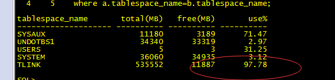
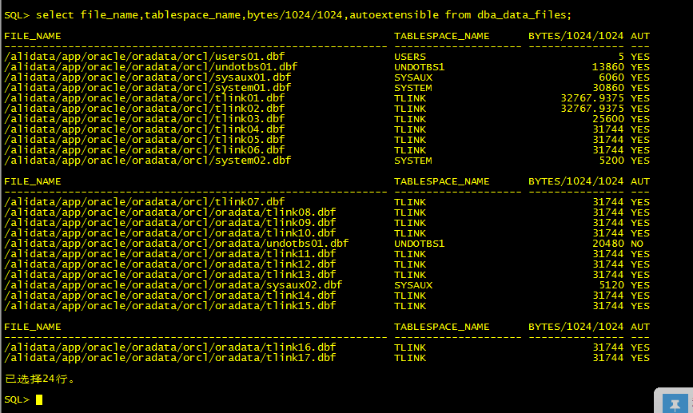
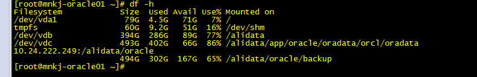

```shell
# 查看表空间
   select a.tablespace_name "tablespace_name",round(total/1024/1024) "total(MB)",round(free/1024/1024) "free(MB)", 
     round((total-free)/total,4)*100  "use%"   
     from (select tablespace_name,sum(bytes) free from dba_free_space group by tablespace_name) a,   
     (select tablespace_name,sum(bytes) total from dba_data_files group by  tablespace_name) b   
     where a.tablespace_name=b.tablespace_name;
```



```shell
# 查看表空间
select file_name,tablespace_name,bytes/1024/1024,autoextensible from dba_data_files;
```



```
# 添加表空间
alter tablespace TLINK add datafile '/alidata/app/oracle/oradata/orcl/oradata/tlink18.dbf' size 31G autoextend on;
```



表空间有上限31G